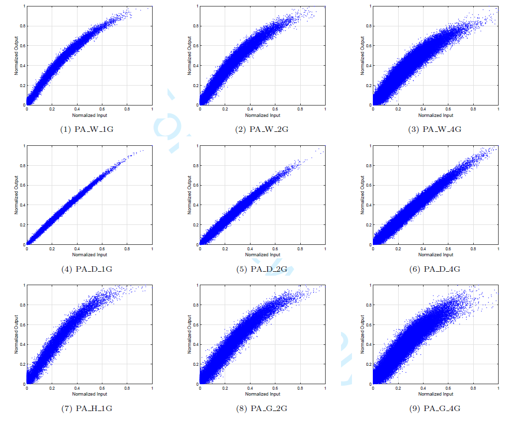
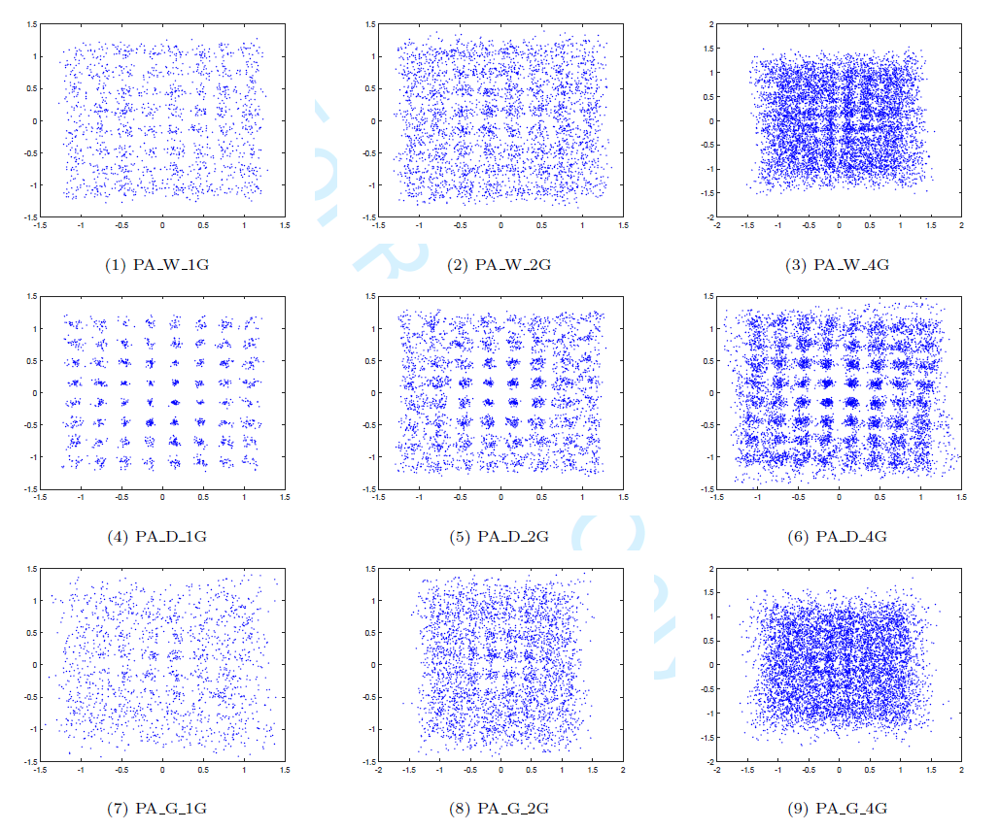
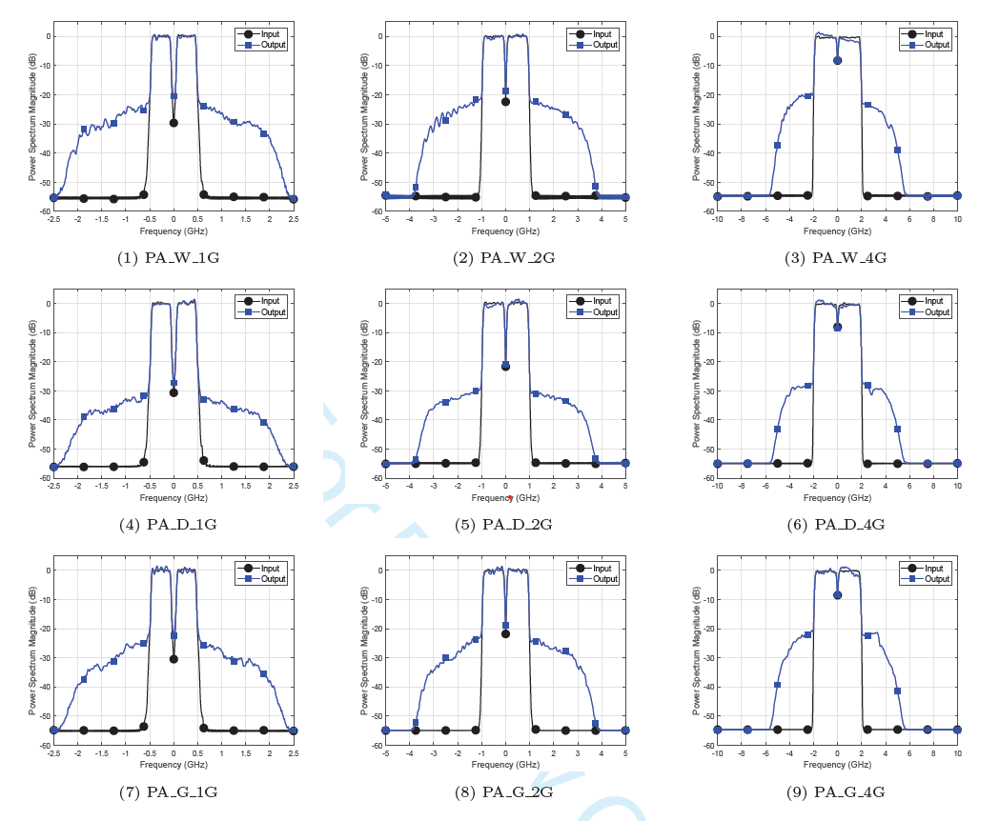
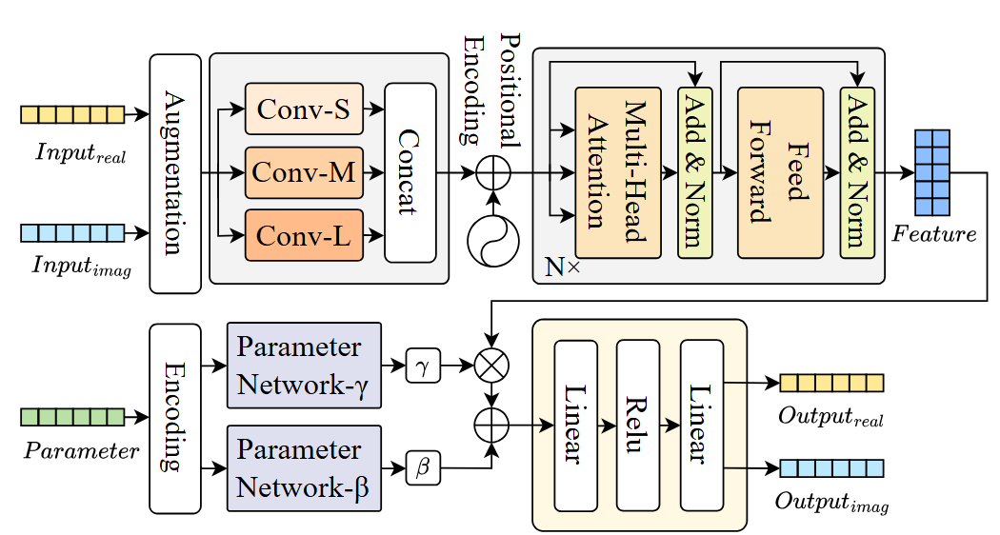

<h1 align="center">
Nonlinear Behaviors of Transceivers for Terahertz Communications: Data Sets and Models
</h1>

This repository provides the datasets and implementation code accompanying the paper *“Nonlinear Behaviors of Transceivers for Terahertz Communications: Data Sets and Models.”*  

## Data Format

The **Terahertz Nonlinear Dataset** is located under:  
```
THz-NL/dataset/DATA_W_D_H_band/Baseband_input_output/
```
This directory contains two main folders:
```
Baseband_input_output/
  ├── input/
  │ ├── D_band/
  │ ├── W_band/
  │ └── H_band/
  └── output/
    ├── D_band/
    ├── W_band/
    └── H_band/
```

- **Input files** are stored under:
```
input/{Band}/PA_input_BS_60G_{CarrierFrequency}G_{QAM}QAM_{FrequencyBand}.mat
```
- **Output files** are stored under:
```
output/{Band}/PA_baseband_{CarrierFrequency}G_{QAM}QAM_{FrequencyBand}_{n}.mat
```
where:  
- `{Band}` ∈ {`D_band`, `W_band`, `H_band`}  
- `{CarrierFrequency}` denotes the carrier frequency (e.g., 1, 2, 4).  
- `{QAM}` represents the modulation order (e.g., 16, 64).  
- `{FrequencyBand}` identifies the operating band (e.g., `D`, `W`, `H`).  
- `{n}` ∈ {1, 2, 3, 4, 5} is the **output index** — each input file corresponds to **five** distinct output files, representing repeated measurements under different amplifier operating conditions.
---

Each `.mat` file contains a **complex-valued time-domain signal**, represented as:

$$x(t) = x_{\text{Re}}(t) + j\,x_{\text{Im}}(t), \quad t = 1, 2, \ldots, T $$

where:  
- $ x_{\text{Re}}(t) $ and $ x_{\text{Im}}(t) $ are the real and imaginary parts, respectively;  
- $ T $ denotes the number of time samples.

## 1. Experimental Platform

Fig. 1 illustrates the experimental setup of the PA test bench, composed of a PC, an arbitrary waveform generator (AWG), mixers, a power amplifier (PA), transmitter and receiver horn antennas, and an oscilloscope.
The baseband input signals are 16/64-quadrature amplitude modulation (16-QAM/64-QAM) orthogonal frequency division multiplexing (OFDM) signals. 

<p align="center">
  <br>
   <strong>Figure 1. Photograph of the PA test bench.</strong>
</p>

At the transmitter side, the baseband signal is loaded by the AWG, and then up-coverted to different test frequency bands through a mixer. 
The corresponding radio frequency signal is amplified by the PA and subsequently radiated through the transmitter horn antenna. 

Following a 1.0-meter wireless transmission, the signal is captured by the receiver horn antenna. 
The received signal is then down-converted to baseband using a mixer synchronized with the same local oscillator and frequency multiplier, and finally captured by an oscilloscope. 
The description of the test signals in the experiments are summarized in Table 1.

<div align="center">
  
**Table 1. Descriptions of the test signals in the experimental platform**

| Test Signal | Frequency Band | Carrier Frequency | Bandwidth |
|----------------|----------|------------|------------|
| PA W 1G | W | 96 GHz | 1 GHz |
| PA W 2G | W | 96 GHz | 2 GHz |
| PA W 4G | W | 96 GHz | 4 GHz |
| PA D 1G | D | 141 GHz | 1 GHz |
| PA D 2G | D | 141 GHz | 2 GHz |
| PA D 4G | D | 141 GHz | 4 GHz |
| PA G 1G | G | 228 GHz | 1 GHz |
| PA G 2G | G | 228 GHz | 2 GHz |
| PA G 4G | G | 228 GHz | 4 GHz |

</div>

## 2. Nonlinearity Analysis
Without loss of generality, we take 64-QAM OFDM input signals as an example for illustrating the PA’s nonlinear behaviors. 
The input signal bandwidth is configured to 1 GHz, 2 GHz and 4 GHz, respectively.
The carrier frequency is set to be 96 GHz, 141 GHz and 228 GHz, corresponding to the W, D and G frequency band, respectively. 

Fig. 2 shows the measured amplitude/amplitude (AM/AM) characteristics of the PAs under different frequency bands and bandwidths. 
The observed spread in the AM/AM response characteristics demonstrates the presence of memory effects in the PAs. 
Furthermore, the AM/AM response reveals a positive correlation between dispersion magnitude and input signal bandwidth. 
This phenomenon indicates enhanced memory effects in power amplifiers when operating under ultra-wideband conditions, with the effect severity scaling proportionally to the bandwidth.

<p align="center">
  <br>
   <strong>Figure 2. The normalized AM/AM curves of PAs in the experimental platform.</strong>
</p>

To further comprehensively evaluate in-band signal distortions and out-of-band spectral leakage induced
by PA nonlinear effects, we further analyze constellation diagrams and power spectral density
(PSD) figures of PA outputs, as illustrated in Fig. 3 and Fig. 4, respectively. 

The constellation diagrams quantify phase and amplitude deviations within the operational bandwidth, while the PSD figures
explicitly reveal harmonic distortions and intermodulation products beyond the allocated spectrum.
From Fig. 3, it is observed that the 64-QAM constellation exhibits pronounced cluster dispersion,
characterized by radial spreading from AM/AM distortions and phase rotations from amplitude/phase
(AM/PM) nonlinearity. Such distortions directly deteriorate the EVM performance, destabilizing highorder
64-QAM demodulation thresholds. Furthermore, as shown in Fig. 4, pronounced out-of-band
spectral leakage is observed. Taking 1 GHz input signal for instance, third-order harmonic emissions
exceeding -26 dBc at 1 GHz offsets, directly violating 3GPP spectral mask requirements and inducing
adjacent-channel interference. Concurrently, severe in-band imbalance manifests as asymmetric constellation
distortion. The trend agrees with the experimental results shown in Fig. 3.

<p align="center">
  <br>
   <strong>Figure 3. The normalized constellation diagrams of 64-QAM OFDM PA output signals in the experimental platform.</strong>
</p>

<p align="center">
  <br>
   <strong>Figure 4. The normalized PSDs of PA outputs in the experimental platform.</strong>
</p>

## 3. Proposed Method

We propose an **Augmented Real-Valued Multi-scale Convolutional Transformer Network (ARVMCTN)** to model the nonlinear behaviors and memory effects of terahertz (THz) transceivers across different frequency bands and bandwidths. The complex baseband inputs are transformed into an augmented real-valued representation by concatenating real and imaginary parts, amplitudes, and higher-order nonlinear terms, allowing comprehensive characterization of signal dynamics. The network adopts a two-stage feature extraction design: a **multi-scale convolutional module** with three parallel 2D convolutional branches captures local features under various receptive fields, followed by **stacked multi-head self-attention Transformer encoders** to model long-range dependencies and global temporal relationships.

To enhance cross-domain generalization, we introduce a **parameter modulation mechanism** that adapts the model to different frequency bands and bandwidths. Domain parameters are one-hot encoded and processed by two lightweight multilayer perceptrons to generate per-channel scaling (γ) and shifting (β) factors, which modulate intermediate features for domain adaptation. Finally, the Transformer outputs are passed through a fully connected regression layer to predict the real and imaginary components of the output signal. This design enables ARVMCTN to effectively capture both local nonlinearities and long-range coupling effects, achieving superior modeling accuracy and robustness in multi-band and ultra-wideband THz systems.

<p align="center">
  <br>
   <strong>Figure 5. Model architecture diagram.</strong>
</p>


